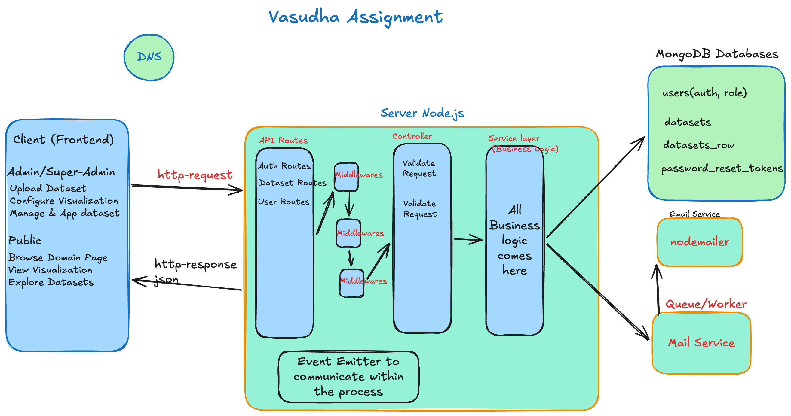

# Vasudha Foundation Data Platform — Backend API

REST API for the Vasudha Foundation climate, energy and power data platform. It handles authentication for Admin and Super Admin roles, CSV dataset ingestion with visualization configuration, a super-admin approval workflow, background email delivery, and password reset. The public-facing frontend consumes the public dataset endpoints.

- **Deployed:** [https://vasudha.saurabhkushwaha.in](https://vasudha.saurabhkushwaha.in) (frontend; this API serves it)
- **Frontend repo:** [Asher9889/vasudha-assignment-frontend](https://github.com/Asher9889/vasudha-assignment-frontend)
- **Backend repo:** [Asher9889/vasudha-assignment-backend](https://github.com/Asher9889/vasudha-assignment-backend)

## Architecture


## Features

- JWT authentication with rotating access/refresh tokens in HTTP-only cookies
- Role-based access for `ADMIN` and `SUPER_ADMIN`
- CSV upload, parsing, per-row validation, and automatic column-type inference (`NUMBER` / `STRING` / `DATE`)
- Dataset creation with template-based visualization configuration (lat-long, state-wise, time-series)
- Super-admin approval workflow (`PENDING` → `APPROVED` / `REJECTED`); only approved datasets are exposed through public endpoints
- Super-admin user management (create admin accounts, enable/disable accounts)
- Forgot / reset password with hashed, short-lived, single-use reset tokens
- Background email delivery via BullMQ — account-creation emails and password-reset emails
- Verification-grade input validation (Zod) on body, query, and params, and a normalized API response envelope

## Requirements Coverage

| Requirement | Status |
| --- | --- |
| Default Super Admin created at deployment | via `npm run seed:super-admin` (uses `SUPER_ADMIN_EMAIL` / `SUPER_ADMIN_PASSWORD` env vars) |
| Super Admin views all datasets and knows which Admin added each | `GET /datasets` (super-admin sees all; `uploadedBy` returned) |
| Super Admin approves / rejects datasets | `PATCH /datasets/:id/status` |
| Super Admin creates / manages / enables or disables Admin accounts | `POST /users`, `GET /users`, `PATCH /users/:id/status` |
| Admin adds CSV datasets with schema validation and rejection errors | `POST /datasets/upload` returns detected schema + invalid-row errors; `POST /datasets` |
| New datasets default to `PENDING` and stay hidden until approved | Public endpoints filter `status = APPROVED` only |
| Domain (Climate / Energy / Power) + chart type selection | `domain`, `templateType`, `chartType`, `visualizationConfig` enforced by schema |
| Admins only see their own datasets; super-admin sees all | `GET /datasets` filters by `uploadedBy` for `ADMIN` |
| Only approved datasets visible publicly | `GET /datasets/public` and `/public/:id` |
| Email notification when an Admin account is created | Extra — `USER_CREATED` event → BullMQ → SMTP |
| Forgot / Reset password via secure email link | Extra — hashed token, 10-minute expiry, single-use |

## Tech Stack

| Area | Technology |
| --- | --- |
| Runtime | Node.js, TypeScript, Express 5 |
| Database | MongoDB (Mongoose 9) — NoSQL chosen for flexible, heterogeneous CSV row data |
| Queue / cache | Redis + BullMQ (async email jobs) |
| Auth | JSON Web Tokens (`jsonwebtoken`), Argon2 password hashing |
| Validation | Zod 4 |
| File upload | Multer (disk storage), `csv-parser` |
| Email | Nodemailer (SMTP) |
| Logging | pino / pino-http |
| Tests | Vitest |

## Architecture

A single Express server mounts feature modules under `/api/v1`. Each module owns its model, Zod schemas, service, controller, and routes. MongoDB connects at import time; domain events fan out to an email listener that enqueues BullMQ jobs processed by a worker.

```
src/
├── server.ts                 # Express bootstrap, CORS, middleware, error handlers
├── db/                       # Mongoose connection + lifecycle/SIGINT handling
├── routes/                   # /api/v1 mount (auth, users, datasets)
├── middlewares/              # authenticate, authorize, zod body/query/params validators, http logger
├── modules/
│   ├── auth/                 # login, refresh, me, logout (cookie-based JWT)
│   ├── user/                 # super-admin user management + USER_CREATED event
│   ├── dataset/              # CSV upload, dataset creation, approval workflow
│   ├── password-reset/       # forgot/reset password + token model + event
│   └── email/                # BullMQ queue/worker, nodemailer, HTML templates
├── events/                   # in-process EventBus (EventEmitter)
├── config/                   # env.config, logger, nodemailer transporter
├── db/, seeders/, utils/     # connection, super-admin seeder, ApiError/ApiResponse
└── types/                    # shared DTO types, Request augmentation
```

Requests are validated by Zod middleware before reaching controllers, responses use a normalized `{ success, statusCode, message, data }` envelope, and errors are centralized in a global error handler using `ApiError`.

## Authentication & Authorization

- **Login** issues two JWTs (`accessToken`, `refreshToken`) in HTTP-only cookies with `SameSite=strict` (and `Secure` when `NODE_ENV=production`). `/auth/refresh` rotates both tokens; `/auth/logout` clears them.
- The `authenticate` middleware verifies the access cookie and rejects non-`ACTIVE` accounts. The `authorize(...roles)` middleware guards super-admin-only routes (RBAC).
- **Roles:** `ADMIN` (submit and view own datasets) and `SUPER_ADMIN` (approve/reject, manage users and all datasets). Admin accounts can be created by the super admin and enabled/disabled.
- **Password reset:** `forgot-password` returns the same generic response whether or not the email exists (no account enumeration), stores only a SHA-256 hash of a random token with a TTL index, and emails `<FRONTEND_URL>/reset-password?token=…`. `reset-password` validates hash, expiry, and single-use, then updates the Argon2-hashed password. JWT sessions are intentionally not invalidated (stateless JWTs).

## Dataset Flow

```
CSV upload → parsing/validation → column-schema detection → visualization configuration → dataset creation → super-admin approval → publication
```

- `POST /datasets/upload` receives a `multipart` CSV, stores it to disk, parses headers/rows with `csv-parser`, rejects empty/duplicate headers, validates every row (with type checks for `NUMBER`/`DATE`), and infers the column schema. Invalid rows are reported with messages instead of blocking the upload.
- A dataset records `title`, `domain` (`CLIMATE`/`ENERGY`/`POWER`), `templateType` (`LAT_LONG`/`STATE_WISE`/`TIME_SERIES`), matching `chartType` (`INDIA_MAP`/`STATE_HEATMAP`/`LINE`/`BAR`/`AREA`), the detected `csvSchema`, and a `visualizationConfig` mapping your dataset columns to the template (latitude/longitude/value, state/value, x-axis/value). A `superRefine` cross-checks config against template.
- Valid rows are persisted into the `dataset_rows` collection; the dataset is created as `PENDING`.
- **Approval:** `PATCH /datasets/:id/status` (super-admin only). Approval stamps `approvedBy`, `approvedAt`, `publishedAt`; rejection records a required `rejectionReason`. Public endpoints return only `APPROVED` datasets, so publication is automatic once approved.

## Password Reset & Email

- `forgotPassword` deletes stale unused tokens for the user, generates a 64-hex raw token, stores its SHA-256 hash with `expiresAt = now + PASSWORD_RESET_TOKEN_TTL_MS`, and emits `PASSWORD_RESET_REQUESTED` with the reset URL.
- `resetPassword` rejects invalid, expired, already-used, or user-deleted tokens uniformly with a generic message, then marks the token used.
- Emails are enqueued on a Redis-backed BullMQ queue (`vasudha-email`, jobs `user_created` and `password_reset`) and sent by a worker via SMTP, so outgoing mail never blocks API responses.

## API

All endpoints are relative to `/api/v1`. "Access token" = valid signed-in cookie is required; "Super admin" additionally requires the `SUPER_ADMIN` role.

| Method | Route | Auth | Purpose |
| --- | --- | --- | --- |
| POST | `/auth/login` | — | Log in (`email`, `password`), sets auth cookies |
| POST | `/auth/refresh` | Access token | Rotate access/refresh tokens |
| GET | `/auth/me` | Access token | Current user profile |
| POST | `/auth/logout` | — | Clear auth cookies |
| POST | `/auth/forgot-password` | — | Send reset link (`email`) — generic response whether or not the account exists |
| POST | `/auth/reset-password` | — | Set new password (`token`, `password`) |
| GET | `/users` | Super admin | List admin accounts (paginated, searchable) |
| POST | `/users` | Super admin | Create a user (`email`, `password`, `role`, `accountStatus`) |
| PATCH | `/users/:id/status` | Super admin | Enable/disable an `ADMIN` account |
| POST | `/datasets/upload` | — | Upload + validate CSV (`multipart/form-data`, field `file`) |
| POST | `/datasets` | — | Create a dataset from an uploaded `fileKey` |
| GET | `/datasets` | Access token | List datasets (admins: own; super-admin: all) |
| GET | `/datasets/:id` | — | Get any dataset with rows (any status) |
| GET | `/datasets/public` | — | List approved datasets (paginated, domain/search/sort filters) |
| GET | `/datasets/public/:id` | — | Get an approved dataset with rows |

## Local Development

```bash
npm install
cp .env.sample .env        # fill in required values (Mongo, Redis, SMTP, JWT, seed creds)
npm run seed:super-admin   # create the Super Admin at deploy/setup time
npm run dev                # dev server (tsx --watch)
```

```bash
npm run build              # compile with tsc → dist/
npm start                  # run the compiled build
npm test                   # Vitest tests (password-reset service)
```

## Database

MongoDB (via `MONGODB_URL`):

- `users` — unique `email`, Argon2-hashed `password`, `role`, `accountStatus`
- `datasets` — metadata, `csvSchema`, `visualizationConfig`, `uploadedBy`, `status`, approval timestamps; indexes on `status`, `uploadedBy`, `domain+status`, `publishedAt`
- `dataset_rows` — row data, unique `datasetId` + `rowIndex`
- `password_reset_tokens` — `tokenHash` (SHA-256), `expiresAt` with a TTL index, `usedAt`

Redis hosts the BullMQ email queue.

## Deployment

A live deployment is running at [https://vasudha.saurabhkushwaha.in](https://vasudha.saurabhkushwaha.in). No Docker/CI config is committed — the backend runs as a plain Node process (`npm start` serves `dist/`) with `.env` providing Mongo, Redis, SMTP, and JWT config. CORS is restricted to `http://localhost:5173` and `https://vasudha.saurabhkushwaha.in`.

## Security

- Argon2 password hashing on the `User` model
- HTTP-only, `SameSite=strict` auth cookies (`Secure` in production)
- Reset tokens stored only as SHA-256 hashes, with a TTL index and single-use flag
- Zod validation on body, query, and params
- CORS origin allowlist
- RBAC via `authorize(...)` for super-admin routes

Notes: dataset upload/create and generic dataset detail are currently unauthenticated, logout does not revoke tokens server-side, and no rate limiting is applied.

## Approach & What's Different

- **NoSQL over SQL:** MongoDB stores heterogeneous CSV rows as `Mixed` documents per dataset, which fits datasets of arbitrary shape without migrations — the assignment allowed either.
- **Cookie-based JWT over bearer-in-localStorage:** HttpOnly + `SameSite=strict` cookies reduce XSS token theft; access tokens are short-lived and refreshed by rotation.
- **Hashed stateless reset tokens** instead of storing raw tokens, so a DB leak cannot replay a reset link. The reset link + expiry + single-use covers the assignment's bonus ("secure email link", "password expiry").
- **Async email off the request path** via Redis-backed BullMQ, so SMTP slowness or failure never blocks creating users or requesting resets.
- **Enum-driven visualization model** (`templateType` + `chartType` + `visualizationConfig`) makes the renderer generic rather than hardcoded to the sample datasets.
- **Uniform response envelope and validation middleware** keep API behavior consistent across modules.